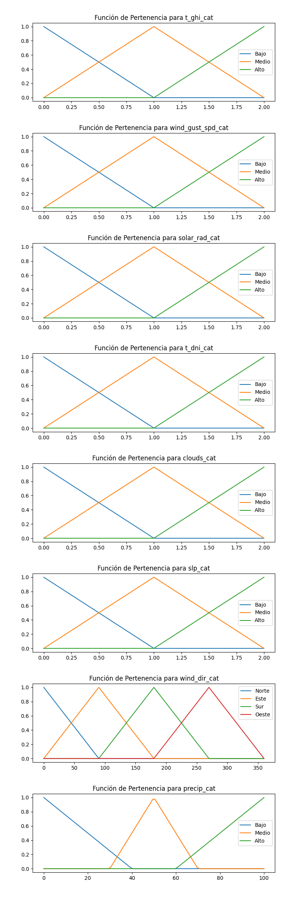

# 🌤️ Weather Prediction using Fuzzy Logic & Association Rules

A web-based system for predicting weather precipitation level using a **Fuzzy Inference System (FIS)** and **Association Rules Mining**, implemented in **Flask**, with a fully interactive front-end.

Users can input meteorological variables via a web interface, and the system will infer the expected precipitation level (Low, Medium, High) based on optimized fuzzy rules generated from real data.


---

## 🚀 Features

✅ Interactive web application (Flask)  
✅ Automatic generation of fuzzy rules using **Association Rule Mining**  
✅ Fuzzy modeling with **scikit-fuzzy**  
✅ Visualization of **membership functions** and **aggregation/defuzzification**  
✅ Based on real data from [Weatherbit](https://www.weatherbit.io/)  
✅ Clean and modular code structure (API + GUI + fuzzy logic engine)

---

## 📊 Example Results

### Input Panel


### Prediction Result


### Aggregation & Defuzzification Graph


### Membership Functions



---

## 🗂️ Project Structure

```txt
WEATHER-PREDICTION/
├── static/                  # Static files (images)
│   └── precipitacion.jpg
├── templates/               # HTML templates
│   ├── index.html
│   └── resultado.html
├── a_difuso.py              # Previous basic fuzzy version
├── api.py                   # Main web app (Flask app.py)
├── comprobar_reglas.py      # Rule checker
├── datos_discretizados.csv  # Final dataset used for rule mining + fuzzy system
├── datos_weatherbit_diarios.csv  # Raw Weatherbit dataset
├── discretizacion.py        # Data discretization process
├── fuzzy.py                 # Fuzzy logic engine
├── genetico.py              # Genetic algorithm to select best features
├── priori.py                # Association Rule Mining (Apriori style)
├── reglas_generadas.txt     # Generated fuzzy rules
├── requirements.txt         # Project dependencies
└── README.md                # Project documentation

⚙️ Installation & Setup

1️⃣ Clone this Repository

git clone https://github.com/yourusername/weather-prediction.git
cd weather-prediction

2️⃣ (Recommended) Create a Virtual Environment

python -m venv venv
# On Windows:
venv\Scripts\activate
# On Linux/Mac:
source venv/bin/activate

3️⃣ Install Dependencies

pip install -r requirements.txt

4️⃣ Run the App

python api.py


📈 How It Works
1️⃣ Data Preparation
Original data obtained from Weatherbit.

Discretization of continuous variables using scientific binning → discretizacion.py.

2️⃣ Association Rule Mining
Mining the optimal rules using lift, support, confidence with priori.py.

Rules are saved in reglas_generadas.txt.

3️⃣ Fuzzy System
Fuzzy membership functions are defined for each variable in api.py & fuzzy.py.

Variables include:

Horizontal Irradiation

Wind Gust Speed

Solar Radiation

Direct Radiation

Cloudiness

Atmospheric Pressure

Wind Direction

Precipitation (target output)

The system builds a ControlSystem dynamically from the rules.

4️⃣ Web Interface
Users input values via sliders and dropdowns.

System performs fuzzy inference and displays:

Precipitation level (Low, Medium, High)

Numerical value and degree of membership.

Visualization of membership functions and defuzzification graph.

📚 Technologies Used
Flask

scikit-fuzzy

matplotlib

pandas

numpy

Association Rules: Custom mining script based on Apriori logic.