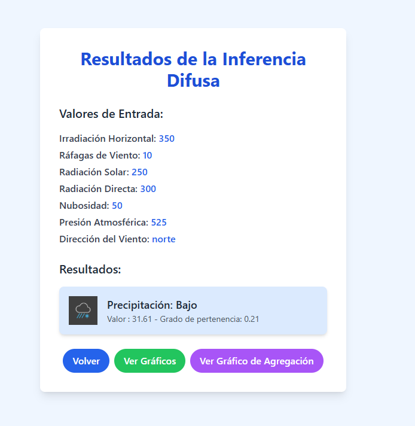

# 🌤️ Weather Prediction using Fuzzy Logic & Association Rules

A web-based system for predicting weather precipitation level using a **Fuzzy Inference System (FIS)** and **Association Rules Mining**, implemented in **Flask**, with a fully interactive front-end.

Users can input meteorological variables via a web interface, and the system will infer the expected precipitation level (Low, Medium, High) based on optimized fuzzy rules generated from real data.


---
The input values are **pre-processed and discretized** into fuzzy categories (Low, Medium, High — or Cardinal directions for Wind Dir).

## 🚀 Features

✅ Interactive web application (Flask)  
✅ Automatic generation of fuzzy rules using **Association Rule Mining**  
✅ Fuzzy modeling with **scikit-fuzzy**  
✅ Visualization of **membership functions** and **aggregation/defuzzification**  
✅ Based on real data from [Weatherbit](https://www.weatherbit.io/)  
✅ Clean and modular code structure (API + GUI + fuzzy logic engine)

---

## 📊 Example Results

### Prediction Result



👉 The system uses a **Fuzzy Inference System** to infer the expected **precipitation level**:

- **Interpretation**: Low, Medium, High
- **Numerical Value**: Exact defuzzified output (centroid value)
- **Membership Degree**: Confidence of the output in the chosen category.

---

### Aggregation & Defuzzification Graph


👉 The **defuzzification process** is visualized here.  
👉 The blue shaded region indicates the **aggregated membership output**, and the black vertical line shows the **centroid defuzzified value** used for the final prediction.

---

### Membership Functions


👉 These plots show the **triangular membership functions** for all input and output variables:

- Each variable has **fuzzy terms** (Low, Medium, High or Cardinal Directions).
- These functions define how crisp input values are mapped to **fuzzy linguistic terms**, which are then used in rule evaluation.

---

## 🧠 Algorithms Used

This system integrates several **Artificial Intelligence techniques**:

### 1️⃣ Association Rule Mining (Apriori style)

- Implemented in `priori.py`.
- Purpose: **Automatically extract relevant rules** from the discretized dataset (`datos_discretizados.csv`).
- Metrics:
  - **Support**
  - **Confidence**
  - **Lift**
- Only rules with high confidence and lift > 1 are kept → ensuring that the system learns **meaningful correlations** in the data.
- Example Rule:  
  `If (Clouds=High AND Wind Gust=High) THEN (Precipitation=High)`

### 2️⃣ Genetic Algorithm (GA)

- Implemented in `genetico.py`.
- Purpose: **Optimize feature selection** — find the best subset of meteorological variables for predicting precipitation.
- Objective function: **Minimize average correlation between selected features** → avoid redundancy and improve model interpretability.
- GA Process:
  - Initial random population.
  - Selection → Crossover → Mutation.
  - Fitness function based on feature correlation.
  - Best subset of features used for final rule mining and fuzzy modeling.

### 3️⃣ Fuzzy Inference System (FIS)

- Implemented in `api.py` and `fuzzy.py`.
- Powered by **scikit-fuzzy**.
- Fuzzy Variables:
  - 7 Inputs + 1 Output.
- Membership functions: **Triangular** (TriMF).
- Rulebase: Dynamically built from `reglas_generadas.txt`.
- Defuzzification method: **Centroid**.


---

## 🗂️ Project Structure

```txt
WEATHER-PREDICTION/
├── static/                  # Static files (images)
│   └── precipitacion.jpg
├── templates/               # HTML templates
│   ├── index.html
│   └── resultado.html
├── a_difuso.py              # Previous basic fuzzy version
├── api.py                   # Main web app (Flask app.py)
├── comprobar_reglas.py      # Rule checker
├── datos_discretizados.csv  # Final dataset used for rule mining + fuzzy system
├── datos_weatherbit_diarios.csv  # Raw Weatherbit dataset
├── discretizacion.py        # Data discretization process
├── fuzzy.py                 # Fuzzy logic engine
├── genetico.py              # Genetic algorithm to select best features
├── priori.py                # Association Rule Mining (Apriori style)
├── reglas_generadas.txt     # Generated fuzzy rules
├── requirements.txt         # Project dependencies
└── README.md                # Project documentation

⚙️ Installation & Setup

1️⃣ Clone this Repository

git clone https://github.com/yourusername/weather-prediction.git
cd weather-prediction

2️⃣ (Recommended) Create a Virtual Environment

python -m venv venv
# On Windows:
venv\Scripts\activate
# On Linux/Mac:
source venv/bin/activate

3️⃣ Install Dependencies

pip install -r requirements.txt

4️⃣ Run the App

python api.py


📈 How It Works
1️⃣ Data Preparation
Original data obtained from Weatherbit.

Discretization of continuous variables using scientific binning → discretizacion.py.

2️⃣ Association Rule Mining
Mining the optimal rules using lift, support, confidence with priori.py.

Rules are saved in reglas_generadas.txt.

3️⃣ Fuzzy System
Fuzzy membership functions are defined for each variable in api.py & fuzzy.py.

Variables include:

Horizontal Irradiation

Wind Gust Speed

Solar Radiation

Direct Radiation

Cloudiness

Atmospheric Pressure

Wind Direction

Precipitation (target output)

The system builds a ControlSystem dynamically from the rules.

4️⃣ Web Interface
Users input values via sliders and dropdowns.

System performs fuzzy inference and displays:

Precipitation level (Low, Medium, High)

Numerical value and degree of membership.

Visualization of membership functions and defuzzification graph.

📚 Technologies Used
Flask

scikit-fuzzy

matplotlib

pandas

numpy

Association Rules: Custom mining script based on Apriori logic.